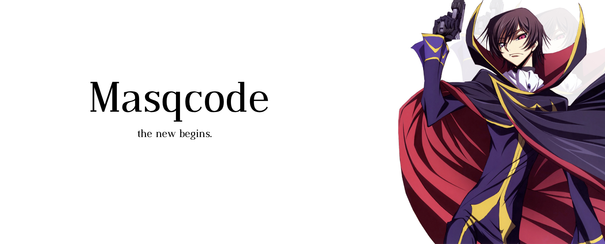

## My domains.
These are the programming languages that I master and that have helped me expand my knowledge in computing.

## Hobbies.
I started making miniatures in Photoshop in 2016, then I switched to Discord in 2018 to monitor community servers and I currently use Blender for my in-game projects in Roblox.

